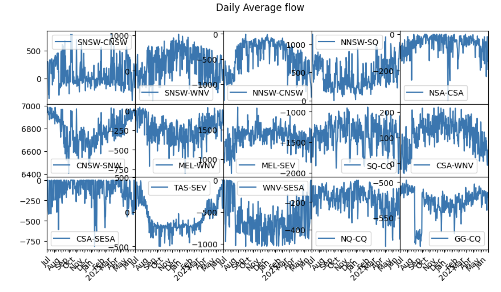
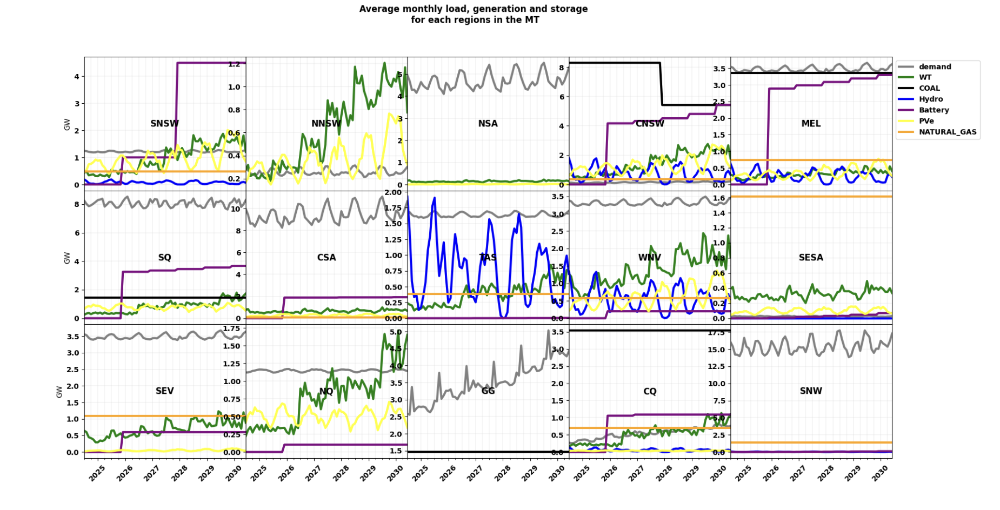
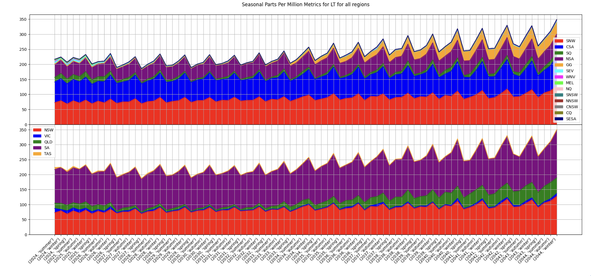

## ensys-arpst-RAAssessment
Resource Adequacy assessment using Security Constraints load, generations and storage data. The project work has four scenarios, and the 2024 ISP demand and generation data. Only the ISP Step Change scenario data is considered, and it is scaled accordingly for the four scenarios.

* ST, Short term for one year from Jul 2024 to June 2025 with 30-minute resolution of time series ISP data.
* MT, Medium term for six years from Jul 2024 to June 2030 with 30-minute resolution of time series ISP data.
* LT, Long term for 20 years from Jul 2024 to Jun 2044 with 60-minute resolution for time series ISP data.
* SUM_ED, Summer extreme days from Jul 2024 to June 2030. Data is sampled for simulation. Only Dec, Jan, and Feb are considered, with daily resampling and maximum values. For the implemented logic, refer to the notebook pre-processing_ISP_data.ipynb.

### Guideline and structure of the repository
* This repository has Julia and Python scripts and notebooks. Jupyter Notebooks are based on the IJulia Kernel for Julia notebooks (system_pras_simulation_jl.ipynb) and Python notebooks. Python notebooks and scripts are under the analysis folder.
* ISP_data_processing folder has all pre- and post-processing data under the data folder with a Python notebook pre-processing_ISP_data.ipynb.
* Under the project root directory, Julia script and notebook can be activated.

### Simulation in Julia and visualisation, analysis in Python notebook
* Julia script pras_simulation.jl can be run for simulation. A simple Julia notebook system_pras_simulation_jl.ipynb can be used for interactive work. Once the simulation is completed, the results are stored. This can be further visualised and analysed in Jupyter notebook, pras_simulation_analysis.ipynb.

### Processing results

* Load flow for ST scenario:

* Load, generation, storage monthly average for MT scenario:
  

* Seasonal Parts Per Million NEUE data for LT scenario:

